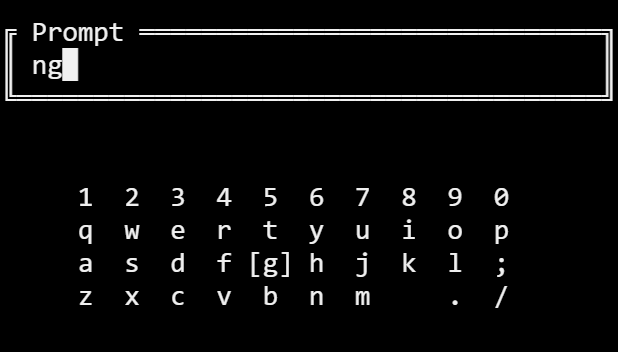

# TUI
Simple Text/Terminal User Interface library and can be used for devices with limited capabilities

[ONLINE DEMO](https://tui.peytoncreery.repl.run/)

## Getting Started

I know that several TUI exist, like curses, asciimatics, urwid, npyscreen, etc but none seemed to have what I needed so I made my own.

### Prerequisites

* python 3

### Installing

```
git clone "https://github.com/phcreery/TUI.git"
```

## Running

Be sure the tui folder is in the same directory. tui is the library
```
sudo python3 main.py
```

### Usage

Currently there is only sever things it does and is pretty limited but this has big dreams.
Here is one example:
```
kbd.tuiinput("Title",(width,height),"small/medium/big/giant","inital text","Tooltip")
```
This displays a textbox with an onscreen QWERTY keyboard that is operated using the WASD keys. The keyboard is changed with R & F keys. Keypress is simulted with E key and Backspcae with C. Q breaks the script.




## ToDo
This is the list of future changes:

 - [ ] More "Modules"
 - [ ] Text boxes
 - [x] Prompts with buttons
 - [x] List
 - [x] Multi-select list


## Authors

* **Peyton Creery** - *Initial work* 
